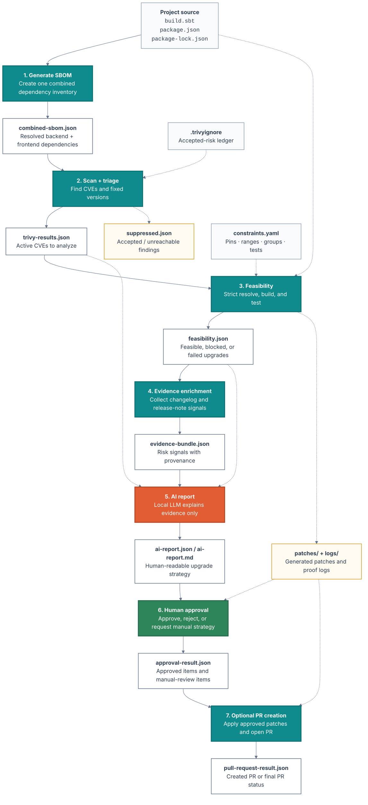

# PatchWise
AI-Enabled evidence-Based CVE Upgrade Advisor

> Deterministic tools decide the facts. AI only explains. A human signs off.

**Overview**

```mermaid
%%{init: {"theme": "base", "themeVariables": {
  "fontFamily": "Inter, Segoe UI, Arial",
  "primaryColor": "#eef7f7",
  "primaryBorderColor": "#0f8b8d",
  "primaryTextColor": "#12343b",
  "lineColor": "#0f8b8d",
  "tertiaryColor": "#ffffff"
}}}%%

flowchart LR
    A["1<br/><b>SBOM</b><br/><code>combined-sbom.json</code>"]
    B["2<br/><b>Scan + triage</b><br/><code>trivy-results.json</code>"]
    C["3<br/><b>Feasibility</b><br/><code>feasibility.json</code>"]
    D["4<br/><b>Evidence</b><br/><code>evidence.json</code>"]
    E["5<br/><b>AI report</b><br/><code>ai-report.json</code>"]
    F["6<br/><b>Approve</b><br/><code>approval.json</code>"]
    G["7<br/><b>PR</b><br/><code>pull-request</code>"]

    A --> B --> C --> D --> E --> F --> G

    classDef deterministic fill:#eef7f7,stroke:#0f8b8d,stroke-width:2px,color:#12343b;
    classDef ai fill:#fff4ef,stroke:#e25d34,stroke-width:2px,color:#12343b;
    classDef human fill:#f0faf3,stroke:#38a169,stroke-width:2px,color:#12343b;

    class A,B,C,D,G deterministic;
    class E ai;
    class F human;
```




**Flow:** 

### Legend

| Color  | Meaning                  |
| ------ | ------------------------ |
| Teal   | Deterministic tool stage |
| Orange | AI-grounded explanation  |
| Green  | Human approval           |
| Grey   | Input/configuration      |


---

## 1. The Problem

### Upgrading for CVEs is slow, risky, and blocked by pins

#### Polyglot sprawl
Two ecosystems, many libraries — Kafka, Play, Akka, Solr — each on its own release cadence and resolver.

#### Pinned versions
Certain versions must stay put because something depends on them. A naive bump breaks the build.

#### Manual triage does not scale
Every CVE means hours of cross-checking:

- Does a fix exist?
- Does it resolve?
- Is it even reachable?

**The cost today:** Security finds the CVE, engineering spends days proving an upgrade is safe, and pins make every case bespoke.

---

## 2. What does PatchWise provide?

### A pipeline that proves the safe upgrade path

For every CVE, the system answers one question deterministically:

> Can we upgrade safely given our pins, and if not, why?

| Step | Name | Purpose |
|---:|---|---|
| 1 | Detect | Inventory + CVE scan |
| 2 | Prove | Feasibility under pins |
| 3 | Explain | AI-written report |
| 4 | Approve | Human signs off |

**Guarantee:** Facts come from tools, never the model. The AI writes the explanation; it cannot invent a CVE, choose a version, or override a pin.


---

## 3. The Safety Model

### AI never produces facts — only judgments over facts

Everything that must be correct comes from deterministic tools:

- Which CVEs apply
- Which versions exist
- Whether the dependency graph still resolves

The model sits in the middle. Even a hallucinated suggestion cannot reach production because it has to pass a real resolver and the test suite first.

```text
Deterministic fact layer
SBOM · CVE scan · strict resolver

AI reasoning, grounded
Explains and sequences — never decides facts

Deterministic validation
Re-resolve · build · tests
```

| Layer | Role |
|---|---|
| Deterministic fact layer | Ground truth |
| AI reasoning | Grounded advisory only |
| Deterministic validation | Verifies proposed changes |


---

## 4. Architecture


```text
Repo
 ├─ Scala/sbt project
 ├─ Angular/package-lock.json
 │
CI job 1: Inventory
 ├─ sbt makeBom
 ├─ collect package-lock.json
 │
CI job 2: Vulnerability scan
 ├─ trivy sbom scala-bom.json → trivy-scala.json
 ├─ trivy fs/package-lock scan → trivy-angular.json
 │
CI job 3: Feasibility engine
 ├─ read Trivy fixed versions
 ├─ read internal Constraints
 ├─ generate candidate bumps
 ├─ run sbt/coursier resolution
 ├─ run npm dry-run / lockfile validation
 ├─ produce feasibility.json
 │
CI job 4: Evidence enrichment
 ├─ fetch changelog/release notes
 ├─ optional: dependency tree explanation
 ├─ produce evidence bundle
 │
CI job 5: AI report
 ├─ LLM reads only evidence bundle
 ├─ emits schema-valid report.json + markdown
 │
CI approval gate
 └─ human approves, rejects, or requests manual strategy
```

| Job | Type | Output |
|---:|---|---|
| 1 | Deterministic | `combined-sbom.json` |
| 2 | Deterministic | `trivy-results.json` |
| 3 | Deterministic | `feasibility.json` |
| 4 | Deterministic evidence collection | `evidence.json` |
| 5 | AI, grounded | `ai-report.json`, `ai-report.md` |
| 6 | Human | `approval.json` |
| 7 | Automation | Pull request |

**Why the separation matters:** Detection, feasibility, evidence, explanation, and approval are distinct stages. Every recommendation is traceable to the exact tool output that produced it.


---

## 5. Job 1 — Inventory

### One SBOM across both stacks

```text
build.sbt       -> sbt-sbom
package-lock    -> cyclonedx-npm
                 -> cyclonedx-cli merge
                 -> combined-sbom.json
```

Pins live in `build.sbt` / `package.json`, not in the SBOM. The SBOM records resolved versions only.

### Example: `combined-sbom.json`

```json
{
  "bomFormat": "CycloneDX",
  "specVersion": "1.5",
  "components": [
    {
      "name": "jackson-databind",
      "version": "2.13.5",
      "purl": "pkg:maven/.../jackson-databind@2.13.5"
    },
    {
      "name": "axios",
      "version": "1.5.0",
      "purl": "pkg:npm/axios@1.5.0"
    }
  ]
}
```


---

## 6. Job 2 — Detect

### Scan the SBOM, then triage what is accepted

```text
combined-sbom.json
    -> Trivy matches CVEs + fixed versions
    -> .trivyignore accepted-risk ledger
    -> trivy-results.json
```

Accepted or unreachable findings are suppressed with a reason and review date so they do not re-enter the pipeline.

### Example: `trivy-results.json`

```json
{
  "Vulnerabilities": [
    {
      "VulnerabilityID": "CVE-2025-27817",
      "PkgName": "org.apache.kafka:kafka-clients",
      "InstalledVersion": "3.4.0",
      "FixedVersion": "3.9.1",
      "Severity": "HIGH"
    }
  ]
}
```


---

## 7. Job 3 — Feasibility: The Heart

### Prove the fix resolves, builds, and tests under our pins

Job 3 is the technical core and the answer to the pin problem.

It uses the package managers' own resolvers as oracles:

1. Pick the fixed version.
2. Respect upgrade-together groups, such as the Jackson family.
3. Resolve strictly.
4. Respect pins.
5. Fail loudly on conflicts.
6. Verify the candidate actually resolved and was not silently evicted.
7. Build and test.

### Possible outcomes

- `feasible`
- `feasible-with-override`
- `blocked-by-pin`
- `blocked-by-resolution`
- `build-failed`
- `test-failed`
- `needs-human-review`

### Example: `feasibility.json`

```json
{
  "summary": {
    "feasible": 1,
    "blocked": 2
  },
  "results": [
    {
      "id": "npm-axios",
      "candidateVersion": "1.6.8",
      "status": "feasible",
      "resolutionCheck": "axios@1.6.8 in lockfile"
    },
    {
      "id": "scala-akka-stream",
      "candidateVersion": "2.7.0",
      "status": "blocked-by-pin",
      "blockingPin": "akka-actor-typed@2.6.20"
    }
  ]
}
```


---

## 8. Jobs 4 and 5 — Evidence, Then Explanation

### Context with provenance; the LLM only writes

#### Job 4: Evidence enrichment

Changelog and release-note signals are collected with:

- Source
- Exact matched text
- Confidence level

No source means no signal.

#### Job 5: AI report with internal Mistral

The AI writes the readable report only.

Rules set the classification; the model cannot change it.

Output is allow-listed. Unknown CVEs, versions, packages, or evidence references are rejected.

### Example: `ai-report.json`

```json
{
  "recommendations": [
    {
      "package": "axios",
      "classification": "safe-to-upgrade",
      "reason": "clean install + build passed; no breaking-change signal",
      "evidenceRefs": [
        "npm-axios.feasibility.status"
      ]
    },
    {
      "package": "jackson-family",
      "classification": "needs-testing",
      "evidenceRefs": [
        "scala-grp-jackson.policyContext.requiredTests"
      ]
    }
  ]
}
```


---

## 9. Jobs 6 and 7 — Approval and PR

### A human decides; only then is a PR prepared

The reviewer sees:

- Severity
- Feasibility result
- Tests
- Constraints
- Evidence confidence
- AI explanation

Approval is per item or per upgrade group.

Blocked items route to a human strategy instead of being forced through.

### Example: `approval-result.json`

```json
{
  "approvalStatus": "partially-approved",
  "approvedItems": [
    "npm-axios",
    "scala-grp-jackson"
  ],
  "manualReviewItems": [
    {
      "id": "scala-akka-stream",
      "reason": "blocked-by-pin; decide on Akka 2.6.20"
    }
  ]
}
```


---

## 10. Why It Will Not Hallucinate

### Six guardrails keep the AI inside the lines

| Guardrail | Explanation |
|---|---|
| Facts from tools | CVEs and fixed versions come from Trivy / OSV, never the model. |
| Resolver as oracle | Feasibility is proven by the real resolver, strictly, not estimated. |
| Rules set the verdict | A deterministic rules engine classifies before the LLM writes. |
| Allow-listed output | Unknown CVEs, versions, or packages in the output are rejected. |
| Everything is cited | Every recommendation points to the evidence that backs it. |
| Human approves | Nothing ships without a person signing off. |


---

## 11. Scope

### A bounded MVP, with a clear path beyond

#### In scope — MVP

- Seven-job pipeline, end to end
- Scala / sbt + Angular / npm on one pilot repo
- Pins, allowed ranges, and upgrade-together groups
- Human approval gate
- PR creation optional

#### Later — deliberately out

- Reachability analysis to reduce CVE noise further
- Multi-repo / org-wide rollout
- Auto-merge of low-risk patches
- Own-code SAST, image scanning, and secret scanning

### Tooling

| Tool | Purpose |
|---|---|
| CycloneDX | SBOM |
| Trivy | Scan |
| coursier / npm | Resolve |
| Internal Mistral | Report |
| GitHub/GitLab CI | Gate |


---

